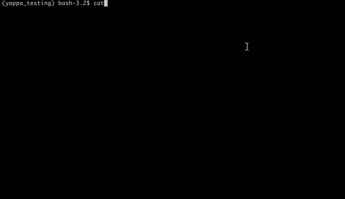

# Yappa: Serverless Python for Yandex Cloud Functions

## About

Deploy your Flask apps to [Yandex Cloud Functions](https://cloud.yandex.ru/services/functions) like a boss.




- [Usage](#usage)
    - [Configure CLIs](#1-configure-clis)
    - [Install yappa & flask](#2-install-yappa--flask)
    - [Create an app](#3-create-an-app)
    - [Generate requirements](#4-generate-requirements)
    - [Deploy](#5-deploy)
- [Limitations](#limitations)
    - [Only one route](#only-one-route)
- [Running without Flask](#running-without-flask)


## Usage


### 1. Configure CLIs

- Install and configure [Yandex CLI](https://cloud.yandex.ru/docs/cli/quickstart)
- Install and configure [AWS CLI](https://docs.aws.amazon.com/cli/latest/userguide/cli-chap-install.html)


### 2. Install yappa & flask

```
pip install yappa
pip install flask
```


### 3. Create an app


```python
from yappa.flask_yandex import FlaskYandex

app = FlaskYandex(__name__)


@app.route('/')
def main():
    return 'Hello from Yappa!'


```

### 4. Generate requirements:
```
pip freeze > requirements.txt
```

### 5. Deploy

Initialize Yappa:

```
yappa init
```

Deploy:
```
yappa deploy
```

After first deploy, you can update your function with:

 
```
yappa update
```


## Limitations

### Only one route

Because Yandex Cloud Functions do not have the concept of URL routies,
Your Flask app can only have one route:

```python
@app.route('/', methods=[...])

```

and all the routing should be done with GET parameters:


```python

from flask import request, render_template

@app.route('/', methods=[...])
def main:
    if request.args.get('dashboard'):
        return render_template('dashboard.html')
    elif request.args.get('user'): 
        return render_template('user.html')
    ...        

```


## Running without Flask

Your app **doesn't have to be a Flask app!**
Yappa can deploy plain python handlers as per [YCF docs](https://cloud.yandex.ru/docs/functions/quickstart/function-quickstart#python-func):

```python
def handler(event, context):
    name = 'World'
    if 'queryStringParameters' in event and 'name' in event['queryStringParameters']:
        name = event['queryStringParameters']['name']

    return {
        'statusCode': 200,
        'headers': {
            'Content-Type': 'text/plain'
        },
        'isBase64Encoded': False,
        'body': 'Hello, {}!'.format(name)
    }
```

In this case, point your `entrypoint` in `yappa-settings.json` to this handler, for example:

```
{
    "project_name": "messageboard-yandex2",
    "entrypoint": "myapp.handler",
    ...
}


```


## Credits

Much of the code is ~~stolen from~~ inspired by the awesome [Zappa](https://github.com/Miserlou/Zappa) project and [Flask-Lambda](https://github.com/techjacker/flask-lambda) package.
The rest is just adapters for YCF quirks.


## If this does not work

The project is in its early stages, and it was only tested on Mac OS. If it does not run on Windows/Linux - PRs are welcome.
